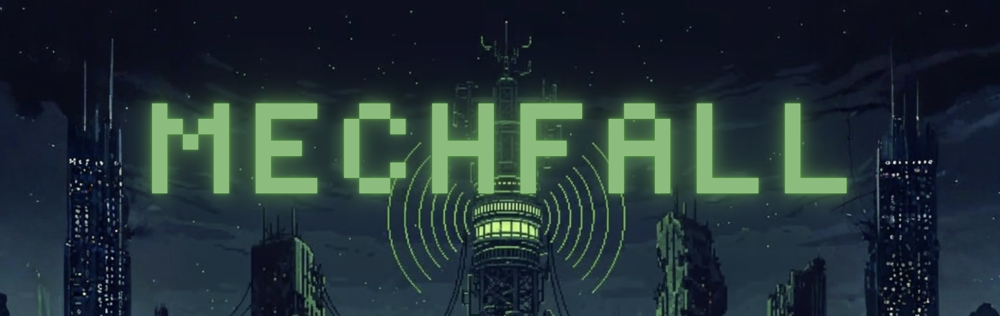

`Mechfall` is a 2D Platformer where we follow the MC as he traverses through a desolite robotic world to free it from chaos and control.
The Platformer was built within the Unity Editor for a SDP Group Assignment at AUT. Within this document it will provide the necessary details on installation, the game itself and its features.

## About 
Mechfall was a project for our dev team to learn valuable skills when conducting a project as a team. This left colloration, communication and planning for us to complete this project and game for others to enjoy. The game offers a variety of different platformer challenges for the player to enjoy and traverse until completing a final boss in Level 4.

## Features and Gameplay
- Single Player Campaign with currently 4 designed Levels with Different Objectives  
- Fast and Responsive Movement System (Move, Jump, Double Jump, Dash, Attack etc)  
- Immersive SoundFX and Music  
- Multiplier Online PVP  
- Leaderboard and Ranking System  

## Dev Team
Chang  
Gabe  
Te-One  
Ted  

## Installation
**Clone the repository:**
   ```bash
   git clone https://github.com/yourusername/mechfall.git
   ```
**If wanting to open in Unity Editor:**    


1. Download 2 package files below and import into project:  
- https://drive.google.com/file/d/1rYF0o4Z3K6IUX8yQptoBY6sS9XbJ5zE6/view?usp=sharing
- https://drive.google.com/file/d/160cQlUZiq_t05lGSVKNcKra046zqVlkB/view?usp=sharing
2. Download json file and place in asset folder:
- https://drive.google.com/file/d/1kXauIP2dbgnOqZ5hun7eCQ3XV8Wtd3_Q/view?usp=sharing

3. Start Playmode from scene called "TestStartPage"

## Contributions
Pull Requests are open. For any Major changes/adjustments, please request an issue where the dev team will discuss what you would like us to change or implement.

## Contact
For questions or collaborations:  
📧 mechfall.devteam@gmail.com  

Thanks Mechfall Dev Team :)
